<div align="center">

# Orbyntiq

### Local-first multi-agent AI platform for private, grounded, agentic, and observable workflows

[](https://github.com/saeednalharbi/Orbyntiq/actions/workflows/ci.yml)
[](https://github.com/saeednalharbi/Orbyntiq/actions/workflows/docker.yml)
[](https://github.com/saeednalharbi/Orbyntiq/actions/workflows/security.yml)


**Orbyntiq combines local LLM inference, LangGraph orchestration, retrieval-augmented generation, MCP capabilities, persistent execution history, real-time WebSocket events, and production-style observability in one end-to-end AI engineering project.**

</div>

<p align="center">
  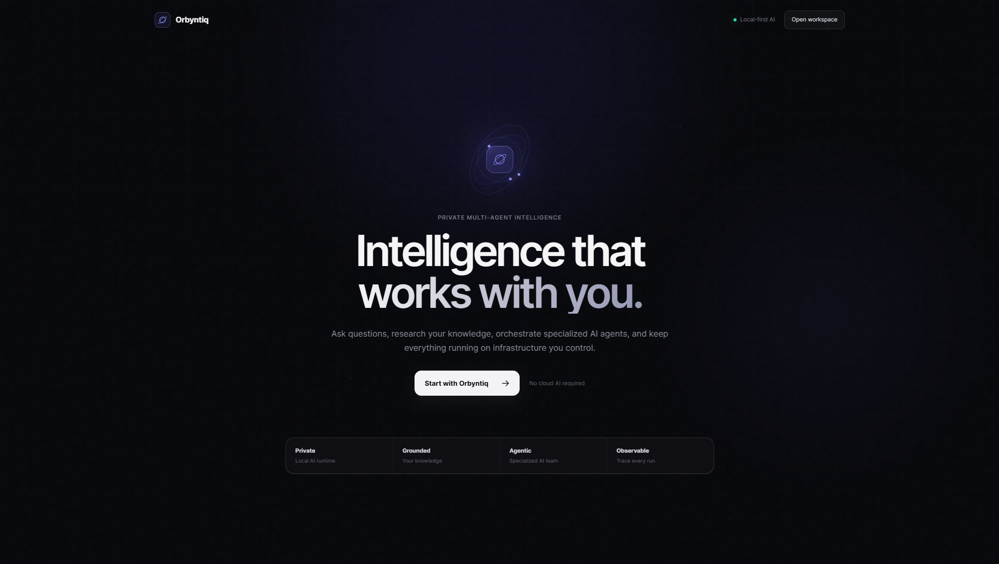
</p>

---

## Contents

- [Overview](#overview)
- [Platform in Action](#platform-in-action)
- [Architecture](#architecture)
- [Core Capabilities](#core-capabilities)
- [Retrieval-Augmented Generation](#retrieval-augmented-generation)
- [Model Context Protocol](#model-context-protocol)
- [Persistence and Execution History](#persistence-and-execution-history)
- [Observability](#observability)
- [API Surface](#api-surface)
- [Testing and Validation](#testing-and-validation)
- [Load Testing](#load-testing)
- [Production End-to-End Verification](#production-end-to-end-verification)
- [CI and Security](#ci-and-security)
- [Getting Started](#getting-started)
- [Repository Structure](#repository-structure)
- [Engineering Focus](#engineering-focus)

---

## Overview

Orbyntiq is a **production-focused, local-first multi-agent AI platform** built to explore the engineering required around modern LLM applications—not just the model call itself.

A request can be:

- answered directly by a general-purpose AI agent,
- routed to a private knowledge base for semantic retrieval and grounded RAG,
- delegated to MCP-backed tools and capabilities,
- persisted as an inspectable execution,
- streamed to the frontend as live workflow events,
- and traced through a complete observability stack.

A **supervisor agent** selects the appropriate specialist route, the specialist performs the task, and a **synthesizer** prepares the final response.

The platform is designed around four principles:

- **Private** — inference runs through a local Ollama runtime.
- **Grounded** — knowledge questions use semantic retrieval and source-aware RAG.
- **Agentic** — LangGraph coordinates supervisor, specialist, and synthesis steps.
- **Observable** — HTTP, WebSocket, LLM, RAG, and agent activity are instrumented.

> **Current project version:** `0.1.0`

### Verified engineering snapshot

| Verification | Recorded result |
| --- | ---: |
| Automated backend tests | **349 passed** |
| Lightweight REST concurrency tested | **100 users, 0 failures** |
| WebSocket heartbeat concurrency tested | **100 users, 0 failures** |
| Production Compose services | **8 services** |
| Agent specialist routes | **3 routes** |
| Trivy HIGH / CRITICAL findings at Phase 12.6 checkpoint | **0** |
| Production E2E | **Passed** |

<p align="center">
  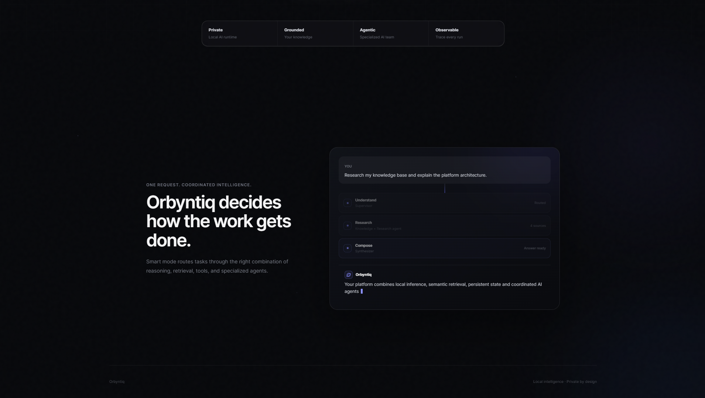
</p>

---

## Platform in Action

### Ask Orbyntiq

The main workspace supports both direct interaction and **Smart mode**, where Orbyntiq selects the appropriate workflow automatically.

<p align="center">
  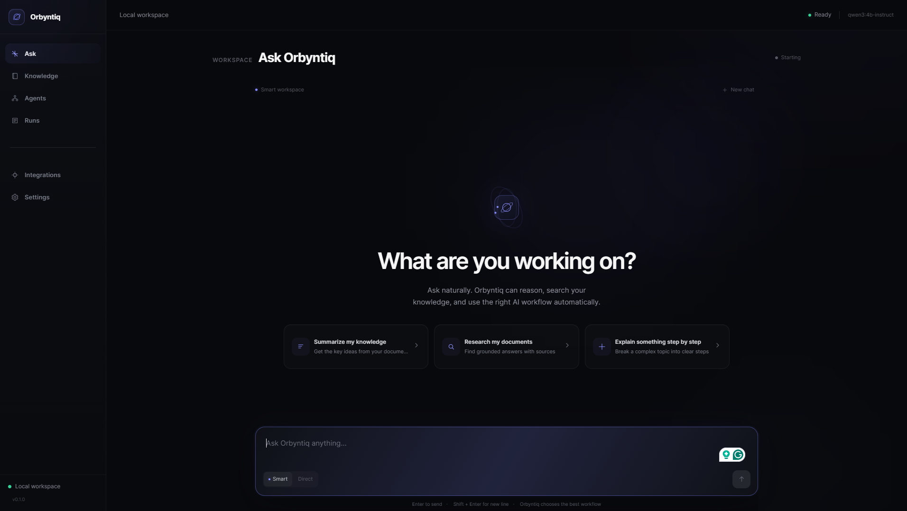
</p>

### Private Knowledge

Documents can be indexed into the local knowledge base and searched semantically. The current document loader supports **TXT, Markdown, and PDF**, including page-aware PDF metadata.

<p align="center">
  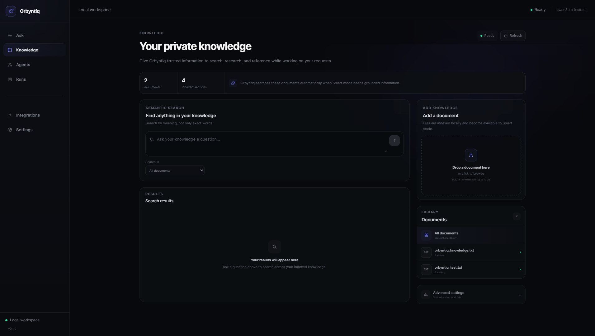
</p>

### Multi-Agent Orchestration

Orbyntiq uses a LangGraph workflow with a supervisor and three specialist routes:

- **Research** — indexed-document retrieval and grounded RAG
- **General** — direct AI reasoning without retrieval or tools
- **MCP** — tool and capability execution

Every specialist route returns through the **Synthesizer** before the workflow completes.

<p align="center">
  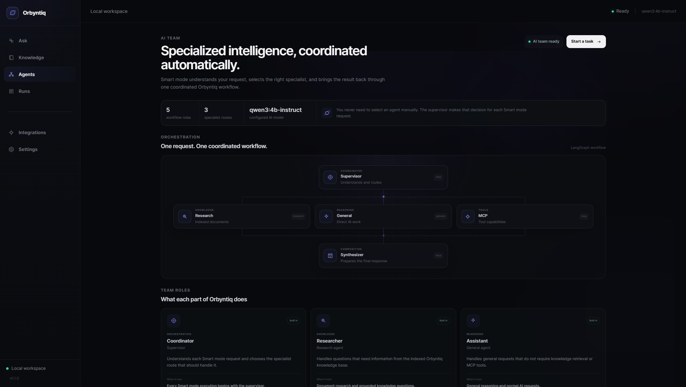
</p>

### Real-Time Smart Workflow

Multi-agent execution is surfaced as live workflow events so the UI can show routing decisions and agent progress while a request is running.

<table>
  <tr>
    <td width="50%">
      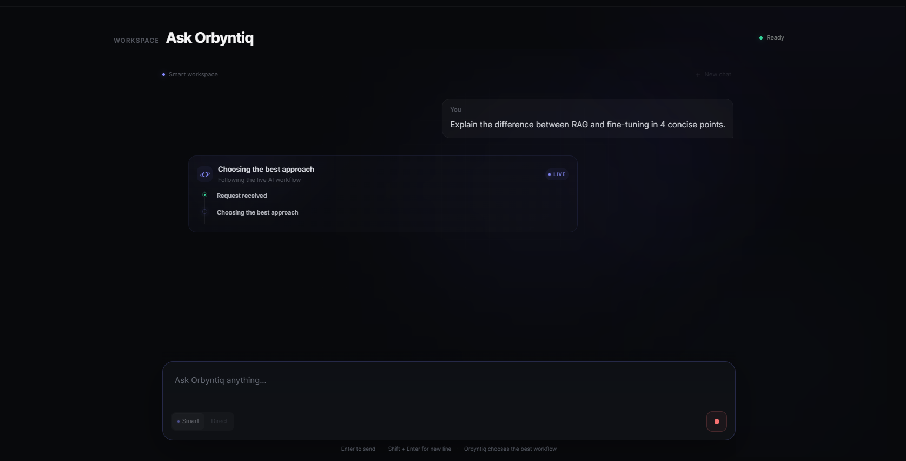
    </td>
    <td width="50%">
      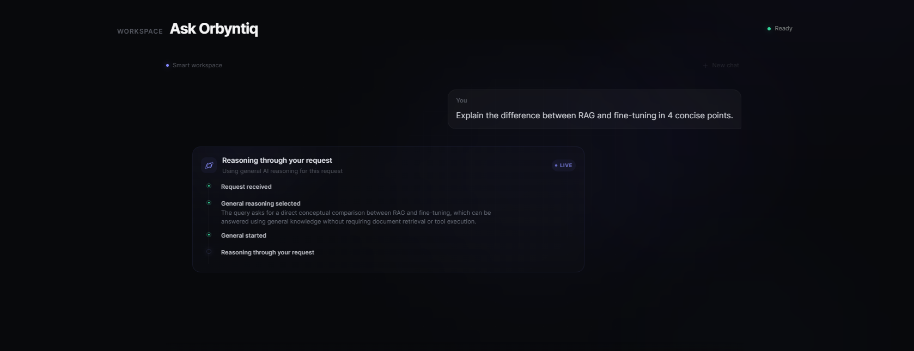
    </td>
  </tr>
</table>

### Final Response and Execution Details

A completed answer is paired with workflow metadata such as the selected route, routing reason, progress events, execution status, and step count.

<table>
  <tr>
    <td width="55%">
      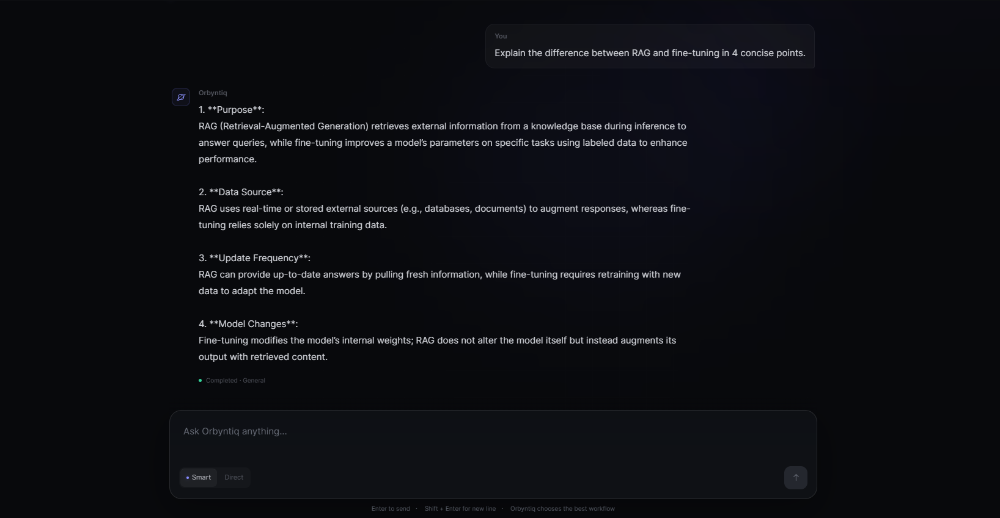
    </td>
    <td width="45%">
      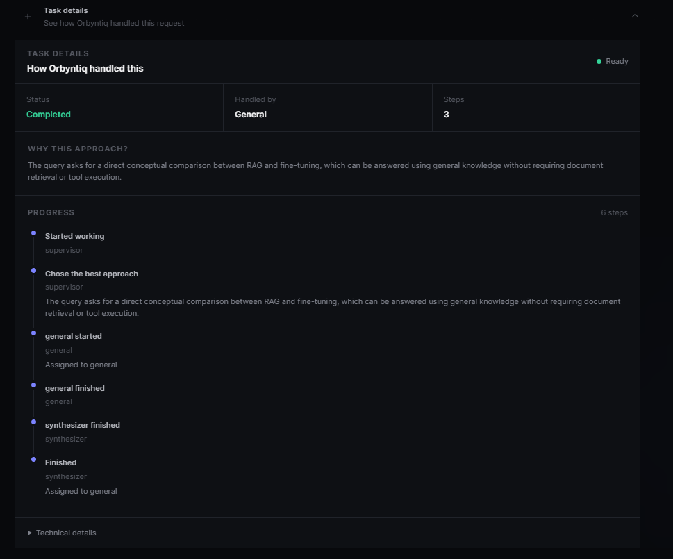
    </td>
  </tr>
</table>

---

## Architecture

```text
Angular Frontend
      |
      | HTTP + WebSocket
      v
FastAPI API
      |
      +-----------------------------+
      |                             |
      v                             v
Direct LLM                    Multi-Agent Service
                                  |
                                  v
                              Supervisor
                         _________|_________
                        /         |         \
                       v          v          v
                  Research      General      MCP
                       \          |          /
                        \_________|_________/
                                  |
                                  v
                             Synthesizer
                                  |
                                  v
                            Final Response
```

Supporting infrastructure:

```text
Ollama
  ├── qwen3:4b-instruct          Local language model
  └── qwen3-embedding:0.6b      Local embedding model

Qdrant                          Vector search
Redis                           Runtime state, sessions and cache services
MongoDB                         Persisted executions and workflow history
OpenTelemetry                   Traces and instrumentation
Prometheus                      Metrics
Tempo                           Trace backend
Grafana                         Dashboards
```

### Request lifecycle

```text
User request
   ↓
FastAPI
   ↓
Supervisor
   ↓
Route decision
   ├── Research → Qdrant → RAG
   ├── General  → Local LLM
   └── MCP      → MCP capability
   ↓
Synthesizer
   ↓
Persist execution + workflow events
   ↓
Stream result to frontend
```

---

## Core Capabilities

| Area | Implementation |
| --- | --- |
| Local inference | Ollama with `qwen3:4b-instruct` |
| Embeddings | Ollama with `qwen3-embedding:0.6b` |
| Backend API | Async FastAPI |
| Frontend | Angular 22 |
| Agent orchestration | LangGraph |
| Workflow roles | Supervisor, Research, General, MCP, Synthesizer |
| Retrieval | Qdrant semantic vector search |
| RAG | Grounded generation with structured source metadata |
| Document ingestion | TXT, Markdown, PDF |
| Real-time communication | WebSocket LLM streaming and multi-agent workflow events |
| Runtime state | Redis |
| Persistence | MongoDB |
| Tool protocol | Model Context Protocol |
| Metrics | Prometheus |
| Tracing | OpenTelemetry + Tempo |
| Dashboards | Grafana |
| Packaging | Multi-stage Docker image |
| Local deployment | Docker Compose |
| Continuous integration | GitHub Actions |
| Security automation | Secret, dependency, and container-image scanning |
| Load testing | Locust |

---

## Retrieval-Augmented Generation

The RAG pipeline follows a grounded retrieval flow:

```text
Document
   ↓
Load + normalize
   ↓
Chunk
   ↓
Generate embeddings
   ↓
Qdrant
   ↓
Semantic retrieval
   ↓
Context construction
   ↓
Local LLM
   ↓
Grounded answer + sources
```

Retrieved results retain metadata including:

- document ID
- source path
- file name
- chunk index
- retrieval score
- page number when available

The research route uses the retrieved context to produce source-aware answers. When no suitable context is available, the RAG service returns a defined no-context response rather than inventing document knowledge.

---

## Model Context Protocol

Orbyntiq includes a built-in MCP server that exposes platform capabilities to compatible agents and clients.

Current MCP capabilities include:

- **Platform status**
- **Search knowledge**
- **Answer with RAG**
- Streamable HTTP transport mounted in the FastAPI application
- An MCP specialist route inside the LangGraph workflow

<p align="center">
  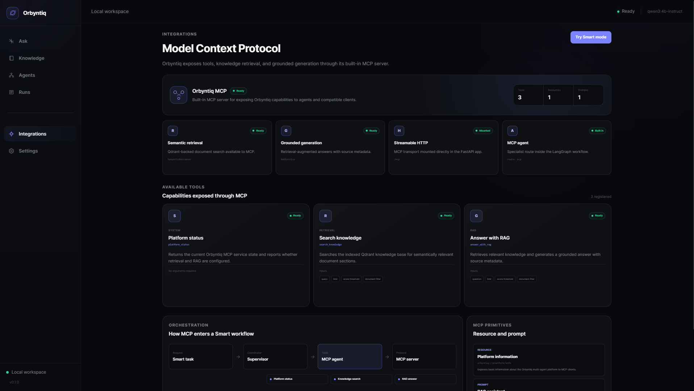
</p>

---

## Persistence and Execution History

Multi-agent runs are persisted in MongoDB together with workflow events. This makes completed and failed executions inspectable after the request finishes.

<p align="center">
  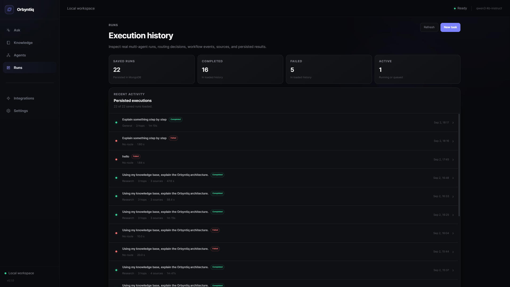
</p>

Persisted execution data is used to support:

- run history
- route inspection
- workflow event inspection
- completion/failure status
- source metadata
- execution IDs and request IDs
- post-run debugging

---

## Local Runtime

The application exposes the health and configuration of its local AI and supporting services from the UI.

<p align="center">
  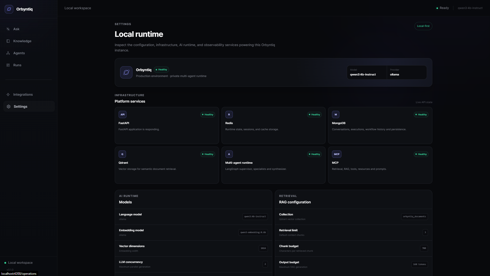
</p>

The production-style Compose stack contains:

```text
api
redis
mongodb
qdrant
otel-collector
tempo
prometheus
grafana
```

The API container is hardened with:

- a non-root `orbyntiq` user (`uid=10001`, `gid=10001`)
- a read-only root filesystem in Compose
- all Linux capabilities dropped
- `no-new-privileges`
- health checks
- persistent infrastructure volumes
- localhost-bound infrastructure ports where appropriate

---

## Observability

Orbyntiq instruments normal application traffic and AI-specific operations.

```text
FastAPI / Agents / RAG / LLM
            |
            v
      OpenTelemetry
            |
            v
   OpenTelemetry Collector
        /           \
       v             v
   Prometheus       Tempo
        \             /
         \           /
             Grafana
```

Instrumentation includes:

- HTTP request counts and latency
- request IDs
- structured JSON request logging
- WebSocket connections and messages
- LLM operations
- multi-agent executions
- routing decisions
- agent status
- RAG operations
- trace/span correlation

---

## API Surface

| Interface | Endpoint |
| --- | --- |
| Health | `GET /health` |
| Metrics | `GET /metrics` |
| Direct LLM chat | `POST /api/v1/llm/chat` |
| Multi-agent execution | `POST /api/v1/agents/execute` |
| WebSocket chat and workflow stream | `WS /api/v1/ws/chat` |
| MCP transport | `/mcp` |

---

## Testing and Validation

The current automated backend test suite contains **349 tests** covering the platform from core infrastructure through orchestration and observability.

```bash
python -m ruff check .
pytest
```

Validated result:

```text
349 passed
```

Coverage includes:

- LLM services and streaming
- Redis state, TTLs and cache behavior
- MongoDB repositories and persistence
- Qdrant lifecycle and retrieval
- document ingestion and chunking
- embeddings
- RAG
- MCP
- LangGraph agents and routing
- REST APIs
- WebSocket behavior
- metrics and tracing
- load-test contracts
- production-oriented service lifecycle behavior

The Angular frontend also has its own unit-test and production-build validation.

---

## Load Testing

Phase 11 used Locust to validate REST and WebSocket behavior on the local development machine.

### Lightweight workloads

| Scenario | Users | Requests / Operations | Failures | P50 | P95 | P99 |
| --- | ---: | ---: | ---: | ---: | ---: | ---: |
| Health endpoint | 100 | 2,893 requests | 0 | 6 ms | 20 ms | 89 ms |
| WebSocket heartbeat | 100 | 1,575 operations | 0 | 3 ms | 57 ms | 180 ms |

The recorded lightweight FastAPI and WebSocket tests handled **100 concurrent local users without request failures**.

### AI workloads

AI tests were intentionally limited to **2 concurrent users** because local Ollama inference and available host memory were the limiting resources on the test machine.

The benchmark documents explicitly avoid claiming a throughput improvement where the measurements did not demonstrate one.

Detailed results:

- `docs/load-testing/phase-11-plan.md`
- `docs/load-testing/phase-11-results.md`

---

## Production End-to-End Verification

Phase 12 introduced a production-oriented E2E smoke script that exercises the real local stack rather than only mocked components.

Verified flow:

```text
Health
  → real LLM REST
  → real LLM WebSocket streaming
  → Redis round-trip
  → embeddings
  → Qdrant
  → RAG
  → LangGraph routing
  → MongoDB execution persistence
  → multi-agent WebSocket events
  → Prometheus metrics
```

The successful production verification ends with:

```text
PRODUCTION_E2E_OK
```

This verification confirmed real communication between the API container and:

- host Ollama
- Redis
- MongoDB
- Qdrant
- OpenTelemetry infrastructure
- Prometheus

---

## CI and Security

Orbyntiq uses three complementary GitHub Actions workflows.

### Python Quality & Tests

- Python 3.11
- dependency installation
- Redis, MongoDB, and Qdrant service dependencies
- Ruff
- complete pytest suite
- Docker Compose validation

### Production Image & Smoke Test

- builds the production Docker image
- validates the non-root image user
- verifies package installation
- verifies Uvicorn
- checks infrastructure readiness
- starts a hardened API container
- validates health in the testing environment
- validates the read-only runtime configuration

### Security CI

- dependency/security scanning
- secret scanning
- production image vulnerability scanning

At the recorded **Phase 12.6** security checkpoint, Trivy reported:

```text
HIGH:     0
CRITICAL: 0
```

The live workflow badges at the top of this README reflect the current GitHub Actions state.

---

## Getting Started

### Prerequisites

The validated local setup uses:

- Docker Desktop
- Docker Compose
- Ollama
- Node.js / npm
- Python 3.11 for local development and testing

### 1. Clone the repository

```bash
git clone https://github.com/saeednalharbi/Orbyntiq.git
cd Orbyntiq
```

### 2. Pull the local AI models

```bash
ollama pull qwen3:4b-instruct
ollama pull qwen3-embedding:0.6b
```

Check that Ollama is already running:

```bash
ollama list
```

> If `ollama serve` reports that port `11434` is already in use, the Ollama service is already running and you do not need to start another instance.

### 3. Start the backend and infrastructure

```bash
docker compose up --build -d
docker compose ps
```

Verify the API:

```bash
curl http://127.0.0.1:8000/health
```

Expected response for the Compose stack:

```json
{
  "status": "healthy",
  "service": "Orbyntiq",
  "environment": "production"
}
```

### 4. Start the Angular frontend

```bash
cd frontend
npm install
npm start
```

Open:

```text
http://localhost:4200
```

### Useful local endpoints

| Service | URL |
| --- | --- |
| Orbyntiq frontend | `http://localhost:4200` |
| FastAPI | `http://127.0.0.1:8000` |
| API docs | `http://127.0.0.1:8000/docs` |
| Grafana | `http://127.0.0.1:3000` |
| Prometheus | `http://127.0.0.1:9090` |
| Qdrant | `http://127.0.0.1:6333` |
| Tempo | `http://127.0.0.1:3200` |

---

## Development Commands

### Backend

```bash
python -m ruff check .
pytest
```

### Frontend

```bash
cd frontend
npm test
npm run build
```

### Docker Compose validation

```bash
docker compose config --quiet
```

### Production E2E verification

```bash
python scripts/verify_production_e2e.py
```

---

## Repository Structure

```text
Orbyntiq/
├── frontend/                     Angular frontend
├── src/orbyntiq/
│   ├── agents/                   LangGraph agents and orchestration
│   ├── api/                      FastAPI routes, middleware and WebSockets
│   ├── core/                     Configuration and infrastructure clients
│   ├── mcp_services/             Model Context Protocol services
│   ├── observability/            Metrics, traces and AI spans
│   ├── rag/                      Documents, embeddings, retrieval and RAG
│   └── services/                 Application services
├── infra/
│   ├── grafana/
│   ├── otel/
│   ├── prometheus/
│   └── tempo/
├── docs/
│   ├── images/
│   └── load-testing/
├── scripts/
├── tests/
├── .github/
│   └── workflows/
│       ├── ci.yml
│       ├── docker.yml
│       └── security.yml
├── compose.yaml
├── Dockerfile
└── pyproject.toml
```

---

## Engineering Focus

Orbyntiq is an **AI engineering portfolio project** focused on the systems required around an LLM:

- local inference
- multi-agent orchestration
- retrieval and grounding
- vector search
- persistent workflow state
- real-time streaming
- MCP integration
- observability
- container hardening
- continuous integration
- security automation
- load testing
- production-style end-to-end verification

The project demonstrates an AI platform architecture that can be **run, inspected, tested, measured, traced, and operated locally**.

---

<div align="center">

### Orbyntiq

**Private intelligence. Grounded knowledge. Coordinated locally.**

`v0.1.0`

</div>
